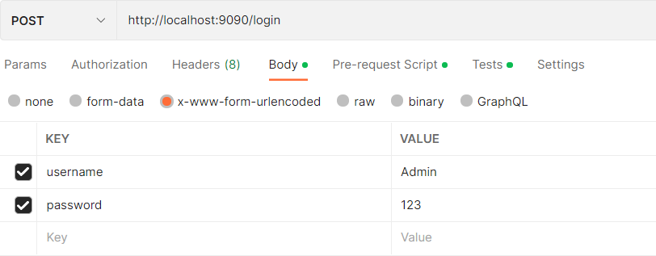
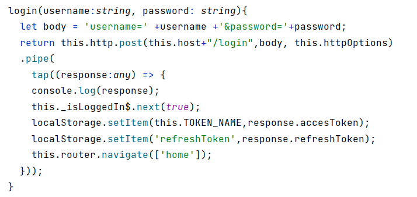

## Spring Security : stateful and Stateless approaches

To authenticate :
POST http://localhost:9090/login username=Admin&password=123

response will contain access_token & refresh_token
>>>>>>> 810e444 (stateless approache)
### authentication using Postman :

### authentication using Front APP :

